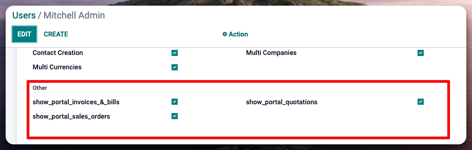
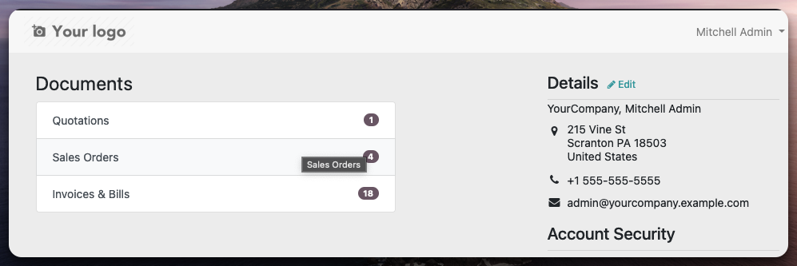
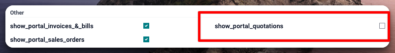
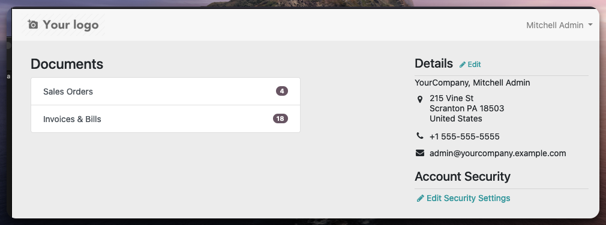
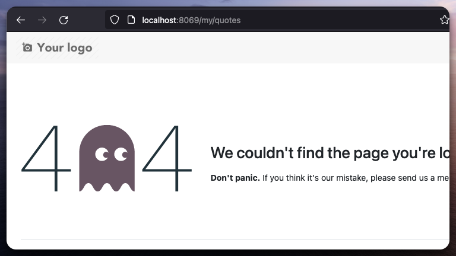

==========================
Hide Portal Module By User
==========================

Show / Hide Specific Portal Docs on res.users

IMPORTANT
=============
!! IMPORTANT !!

This module doesnt modify the access rights of the users, it only hides the documents.

This Module will Allow to enter a specific document via URL even when the user does not have the group assigned to it.

REVIEW YOUR USE CASES

Example:

if you dont have the group assigned to it.

- you can access to the document via URL: /my/orders/6?access_token=0f13c269-0f10-46dc-81f8-4db9682f2267
- but not to my/orders

PLEASE MAKE A PR IF YOU I MISSED TO WHITELIST A ROUTE URL

Usage
=====

To use this module, you need to:

#. Install and Configure the Groups and Users

How it Works
=====
- At Installation, the module will search for all the views that inherits portal.portal_my_home and create a group based on the URL that its linked to in the anchor tag.
- Post Installation, the module will detect if a new view is created inheriting the portal home and create the group.
- We Add a validation at view level to hide the group and a validation when trying to list the portal documents.

Changelog
=========
