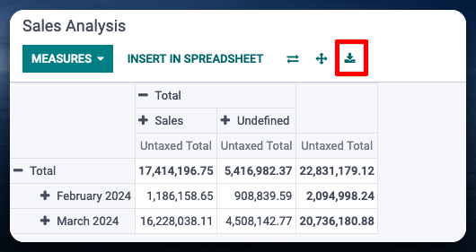
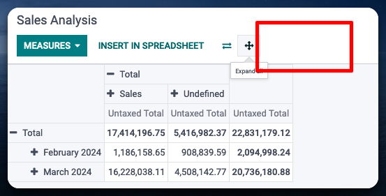

=====================
Web Hide Pivot Export
=====================

Ability to hide export for users without custom group

Configuration
=============

To configure this module, you need to:

#. Configure the group that will have access to the export feature "Show Pivot Export"

Usage
=====

To use this module, you need to:

#. install, restart window if needed.

Changelog
=========
